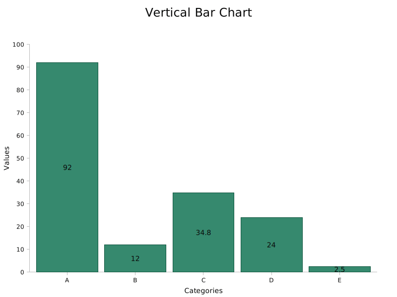

# lc-render

## Examples

You can find examples in `examples` directory.  
Use `cargo run` to create charts from them:

```sh
cargo run --example vertical_bar_chart
```

All examples create images in `svg` directory.  
The command above creates the following chart:


