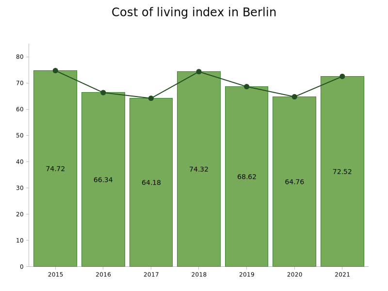
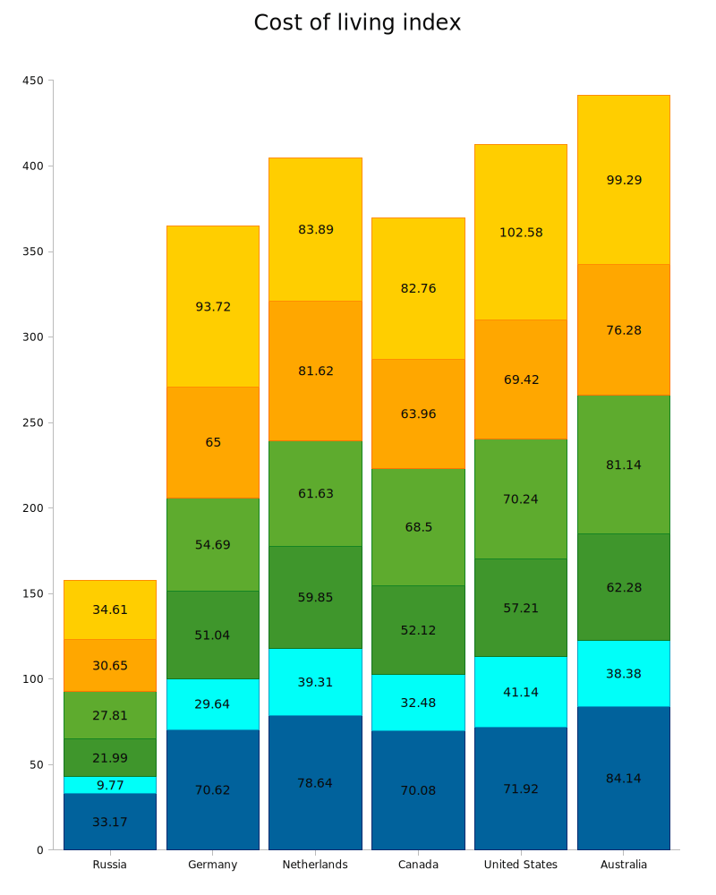

# lc-render

[](https://crates.io/crates/lc-render)
[](https://docs.rs/lc-render)
[](https://github.com/limpidchart/lc-render/actions/workflows/inspection.yml)

Library to create charts images

## Examples

You can find examples in [examples](https://github.com/limpidchart/lc-render/tree/main/examples) directory.  
Use `cargo run` to create charts from them:

```sh
cargo run --example stacked_vertical_bar_chart
```

All examples create images in [examples/svg](https://github.com/limpidchart/lc-render/tree/main/examples/svg) directory.  
You can see some of them here:




## Benchmarks

There are benchmarks for different chart views in [benches](https://github.com/limpidchart/lc-render/tree/main/benches) directory that are implemented with `criterion` crate.

```shell
benches
├── area_chart.rs
├── horizontal_bar_chart.rs
├── line_and_vertical_bar_chart.rs
├── line_chart.rs
├── scatter_chart.rs
├── stacked_horizontal_bar_chart.rs
├── stacked_vertical_bar_chart.rs
├── ten_lines_chart.rs
├── ten_scatters_chart.rs
└── vertical_bar_chart.rs

```

### Benchmarks results

```shell
Hardware
========
MacBook Pro (2018)
2,2 GHz 6-Core Intel Core i7
16 GB 2400 MHz DDR4

Results
=======
area_chart/100          time:   [299.08 us 299.89 us 300.75 us]
area_chart/1000         time:   [2.8673 ms 2.8790 ms 2.8923 ms]
area_chart/10000        time:   [30.595 ms 30.681 ms 30.772 ms]
area_chart/100000       time:   [393.15 ms 394.53 ms 395.92 ms]
area_chart/1000000      time:   [5.6421 s 5.6593 s 5.6753 s]

horizontal_bar_chart/100      time:    [223.01 us 223.27 us 223.56 us]
horizontal_bar_chart/1000     time:    [2.2008 ms 2.2041 ms 2.2076 ms]
horizontal_bar_chart/10000    time:    [24.268 ms 24.353 ms 24.444 ms]
horizontal_bar_chart/100000   time:    [354.33 ms 355.73 ms 357.28 ms]
horizontal_bar_chart/1000000  time:    [5.6904 s 5.7005 s 5.7104 s]

line_and_vertical_bar_chart/100     time:   [358.91 us 359.63 us 360.48 us]
line_and_vertical_bar_chart/1000    time:   [3.4821 ms 3.4886 ms 3.4959 ms]
line_and_vertical_bar_chart/10000   time:   [39.359 ms 39.435 ms 39.517 ms]
line_and_vertical_bar_chart/100000  time:   [513.28 ms 514.80 ms 516.38 ms]
line_and_vertical_bar_chart/1000000 time:   [7.5331 s 7.5654 s 7.6001 s]

line_chart/100          time:   [344.40 us 345.16 us 346.02 us]
line_chart/1000         time:   [3.2811 ms 3.2894 ms 3.2980 ms]
line_chart/10000        time:   [34.950 ms 35.048 ms 35.152 ms]
line_chart/100000       time:   [470.41 ms 472.19 ms 473.97 ms]
line_chart/1000000      time:   [6.4853 s 6.5145 s 6.5435 s]

scatter_chart/100       time:   [131.59 us 131.79 us 132.03 us]
scatter_chart/1000      time:   [1.1717 ms 1.1734 ms 1.1753 ms]
scatter_chart/10000     time:   [11.566 ms 11.584 ms 11.604 ms]
scatter_chart/100000    time:   [133.94 ms 134.19 ms 134.44 ms]
scatter_chart/1000000   time:   [1.3299 s 1.3321 s 1.3342 s]

stacked_horizontal_bar_chart/100     time:    [902.05 us 903.52 us 905.21 us]
stacked_horizontal_bar_chart/1000    time:    [9.9249 ms 9.9445 ms 9.9643 ms]
stacked_horizontal_bar_chart/10000   time:    [109.07 ms 109.58 ms 110.12 ms]
stacked_horizontal_bar_chart/100000  time:    [1.5029 s 1.5100 s 1.5173 s]
stacked_horizontal_bar_chart/1000000 time:    [18.385 s 18.462 s 18.537 s]

stacked_vertical_bar_chart/100     time:   [896.21 us 897.51 us 899.04 us]
stacked_vertical_bar_chart/1000    time:   [9.8916 ms 9.9121 ms 9.9329 ms]
stacked_vertical_bar_chart/10000   time:   [104.04 ms 104.53 ms 105.06 ms]
stacked_vertical_bar_chart/100000  time:   [1.3836 s 1.3868 s 1.3902 s]
stacked_vertical_bar_chart/1000000 time:   [17.626 s 17.701 s 17.779 s]

ten_lines_chart/100     time:   [1.5183 ms 1.5259 ms 1.5346 ms]
ten_lines_chart/1000    time:   [15.348 ms 15.399 ms 15.452 ms]
ten_lines_chart/10000   time:   [169.87 ms 170.45 ms 171.05 ms]
ten_lines_chart/100000  time:   [2.1748 s 2.1808 s 2.1865 s]
ten_lines_chart/1000000 time:   [25.100 s 25.212 s 25.331 s]

ten_scatters_chart/100     time:   [1.1790 ms 1.1828 ms 1.1869 ms]
ten_scatters_chart/1000    time:   [11.629 ms 11.682 ms 11.757 ms]
ten_scatters_chart/10000   time:   [123.34 ms 123.62 ms 123.91 ms]
ten_scatters_chart/100000  time:   [1.3547 s 1.3564 s 1.3582 s]
ten_scatters_chart/1000000 time:   [13.507 s 13.520 s 13.533 s]

vertical_bar_chart/100     time:   [224.81 us 225.58 us 226.75 us]
vertical_bar_chart/1000    time:   [2.1700 ms 2.1746 ms 2.1795 ms]
vertical_bar_chart/10000   time:   [24.008 ms 24.067 ms 24.129 ms]
vertical_bar_chart/100000  time:   [337.56 ms 338.45 ms 339.36 ms]
vertical_bar_chart/1000000 time:   [5.2513 s 5.2616 s 5.2718 s]
```

# Thanks

SVG drawing logic is based on [rustplotlib](https://github.com/askanium/rustplotlib). Big thanks to them!